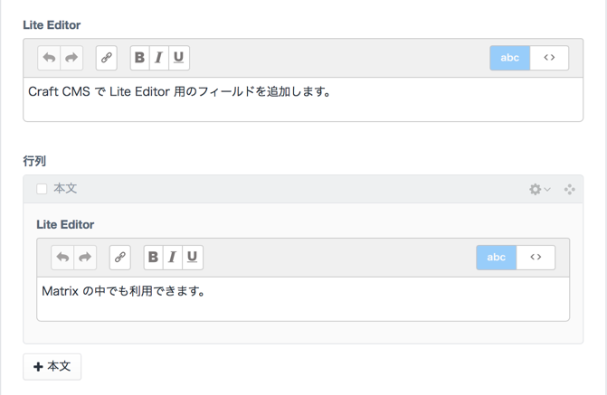

# LiteEditor plugin for Craft CMS

This plugin is Lite Editor FieldType for Craft CMS.



## Installation

To install LiteEditor, follow these steps:

1. Download & unzip the file and place the `liteeditor` directory into your `craft/plugins` directory
2.  -OR- do a `git clone https://github.com/dreamseeker/liteeditor.git` directly into your `craft/plugins` folder.  You can then update it with `git pull`
3.  -OR- install with Composer via `composer require dreamseeker/liteeditor`
4. Install plugin in the Craft Control Panel under Settings > Plugins
5. The plugin folder should be named `liteeditor` for Craft to see it.  GitHub recently started appending `-master` (the branch name) to the name of the folder for zip file downloads.

LiteEditor works on Craft 2.4.x and Craft 2.5.x.

## LiteEditor Overview

LiteEditor adds "LiteEditor" FieldType which can use any sections of CraftCMS. 

## Configuring LiteEditor

Create a Lite Editor field via Settings->Fields.


> [hint] When you want to customize initialization options, please prepare a JSON files to `craft/config/liteeditor` like Redactor. 

## Using LiteEditor in your Template

If the handle of a LiteEditor Field is set to "liteBody", I can output in following Codes. 

```twig
{{ entry.liteBody.text | raw }}
```

## LiteEditor Changelog

### 1.0.0 -- 2018.01.20

* Initial release

Brought to you by [dreamseeker](https://github.com/dreamseeker)

## Special Thanks

**Lite Editor - A Modern WYSIWYG Editor especially for inline elements**  
[https://appleple.github.io/lite-editor/](https://appleple.github.io/lite-editor/)
